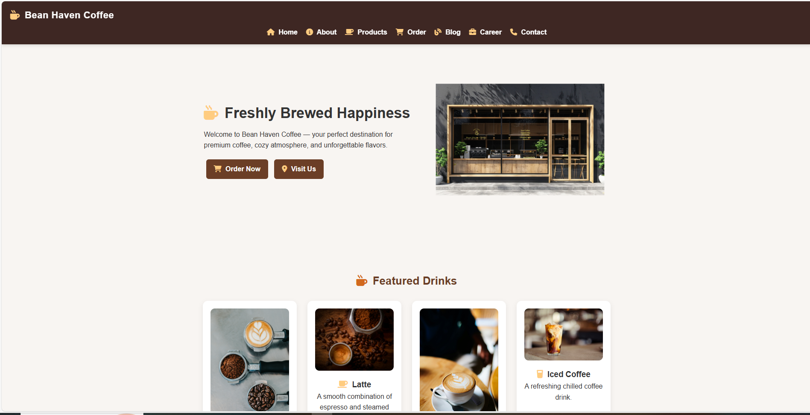

# ☕ Bean Haven Coffee – Frontend Coffee Shop Website

## 📌 Project Overview

**Bean Haven Coffee** is a fully responsive coffee shop website built using **HTML, CSS, and JavaScript**.

This project simulates a modern café website with product listings, shopping cart functionality, testimonials, and contact sections. It demonstrates real-world frontend development skills such as responsive design, UI layout, and JavaScript interactivity.

The goal of this project was to strengthen frontend development skills and build a professional portfolio project suitable for internships, freelance work, and junior frontend roles.

---

## 🚀 Live Demo

🔗 https://mayuresh-2601.github.io/bean-haven-coffee/

---

## 🎯 Key Features

✔ Responsive Navigation Bar
✔ Coffee Product Menu Section
✔ Add-to-Cart Functionality
✔ Dynamic Cart Total Calculation
✔ Testimonials Section
✔ Contact Form UI
✔ Smooth Scrolling Effects
✔ Hover Animations & Transitions
✔ Fully Responsive Layout (Mobile Friendly)

---

## 🛠️ Technologies Used

* HTML5 (Semantic Structure)
* CSS3 (Flexbox, Grid, Media Queries)
* JavaScript (DOM Manipulation, Event Handling)
* Google Fonts
* Font Awesome Icons

---

## 📂 Project Structure

Bean-Haven-Coffee/

├── index.html
├── css/
│   └── style.css
├── js/
│   └── script.js
├── images/
│   ├── coffee1.jpg
│   ├── coffee2.jpg
│   └── logo.png
└── README.md

---

## 🧠 JavaScript Functionalities Implemented

### 🛒 Add to Cart System

* Adds selected coffee items to cart
* Updates cart count dynamically
* Calculates total price automatically

### 📦 Dynamic UI Updates

* Real-time cart updates
* Interactive button behavior
* Event handling using JavaScript

### 📱 Responsive Navigation

* Mobile-friendly layout
* Responsive menu behavior
* Media query-based design

---

## 📊 UI & UX Highlights

* Modern coffee shop design
* Clean and simple layout
* Smooth hover animations
* User-friendly navigation
* Mobile responsiveness
* Consistent color theme

---

## 📈 What I Learned

* Building real-world website layouts
* Responsive design using Flexbox & Grid
* JavaScript DOM manipulation
* Event-driven programming
* UI/UX design principles
* Git & GitHub workflow
* Deploying websites using GitHub Pages

---

## 🚀 How to Run This Project Locally

1. Clone this repository:

git clone https://github.com/mayuresh-2601/bean-haven-coffee.git

2. Open the project folder

3. Open `index.html` in your browser

No backend or dependencies required.

---

## 👨‍💻 Author

**Mayuresh Kasar**
Frontend Developer | Web Development Enthusiast

GitHub:
https://github.com/mayuresh-2601

---

## ⭐ Support

If you like this project, consider giving it a ⭐ on GitHub!
